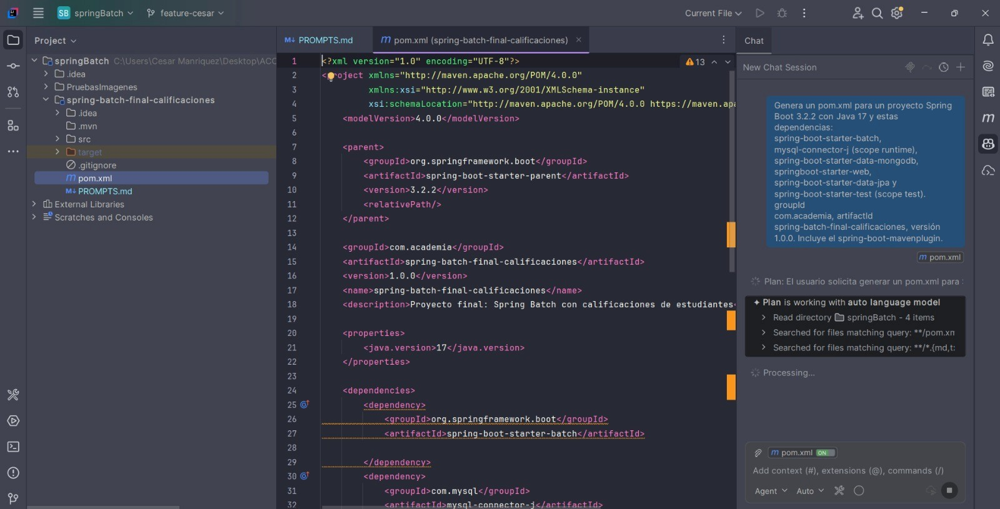
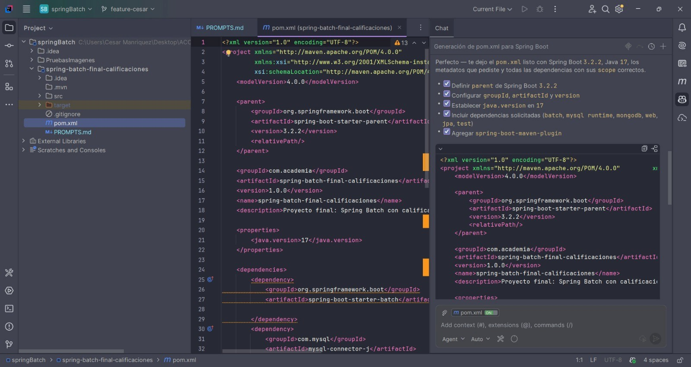
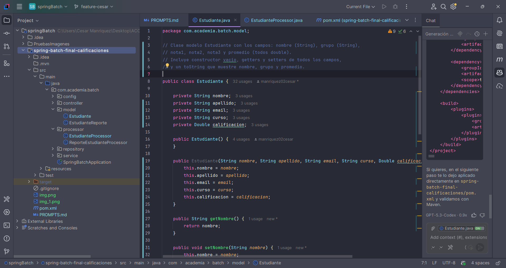
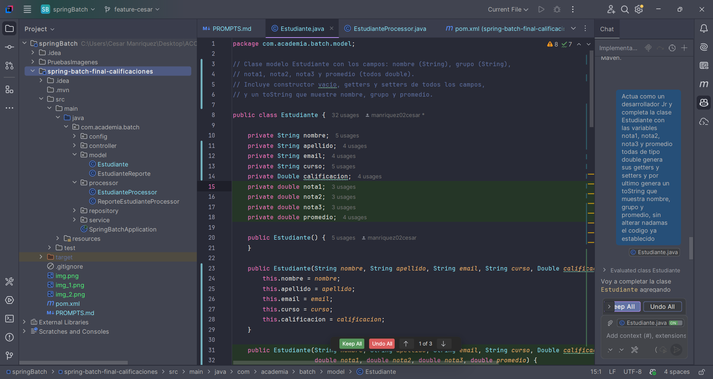
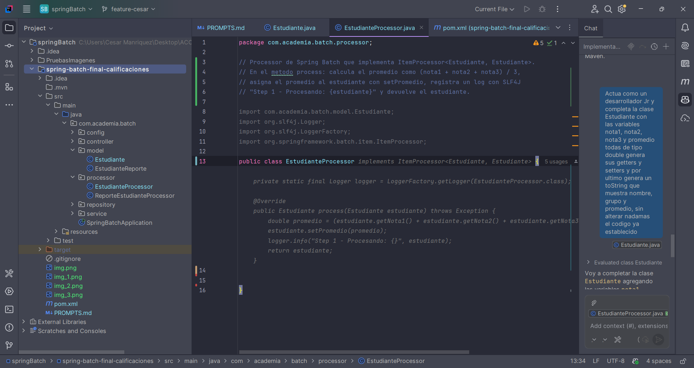
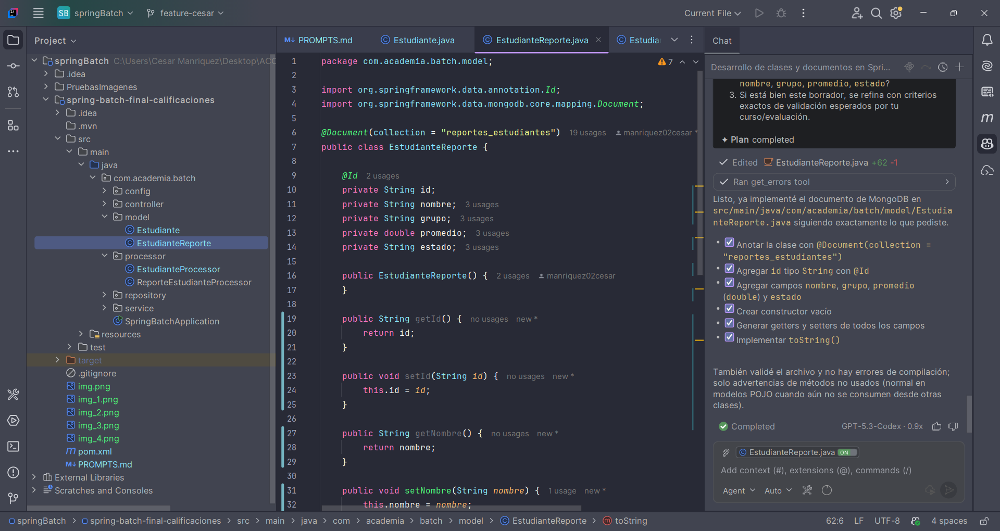
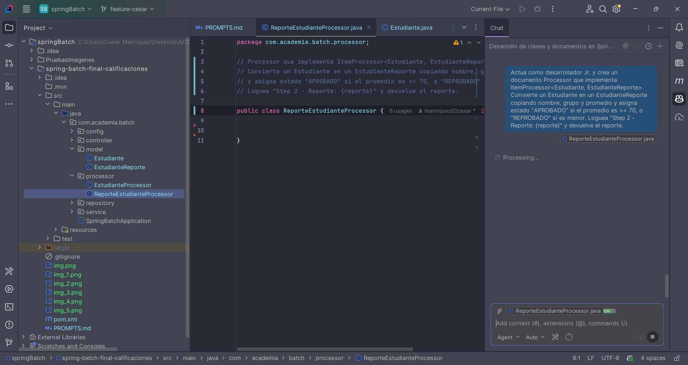
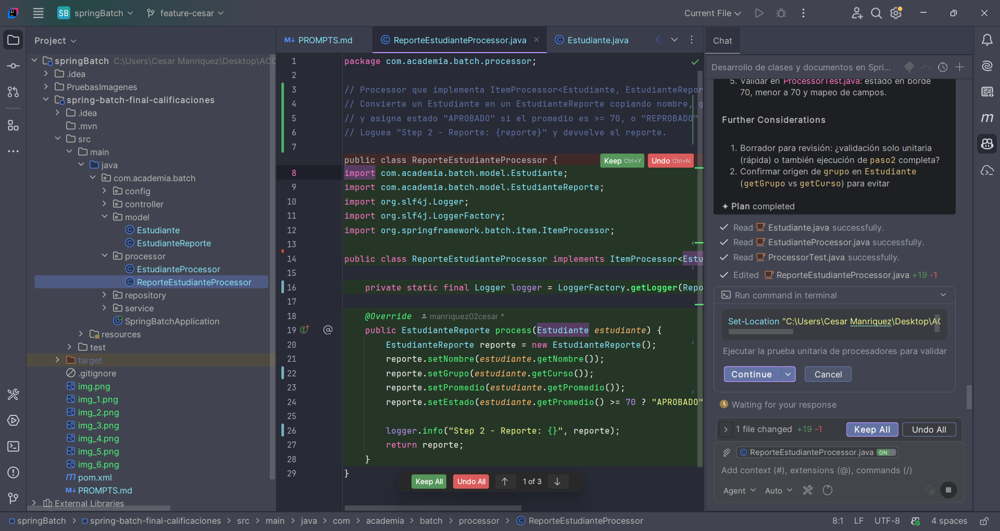
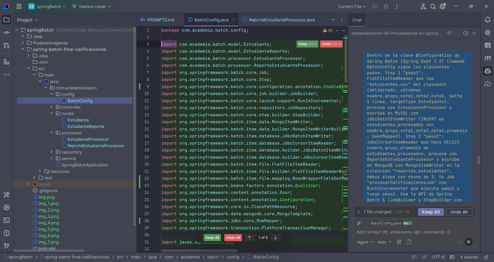
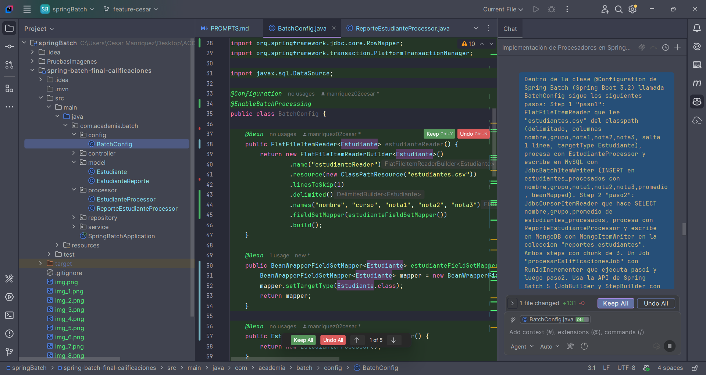

# TALLER PRACTICO PARA PROYECTO FINAL PROMPTS
## pom.xml
Se pide a copilot generar un archivo pom.xml con las dependencias necesarias:
### PROMPT:
`Genera un pom.xml para un proyecto Spring Boot 3.2.2 con Java 17 y estas dependencias:
spring-boot-starter-batch, mysql-connector-j (scope runtime), spring-boot-starter-data-mongodb, springboot-starter-web, spring-boot-starter-data-jpa y spring-boot-starter-test (scope test). groupId
com.academia, artifactId spring-batch-final-calificaciones, versión 1.0.0. Incluye el spring-boot-mavenplugin.`

Adjunto evidencia de como se genera la respuesta de Copilot:

Validando que el archivo generado cumpla con los requerimientos solicitados:

## Genereando el modelo estudiante

Como podemos observar en la imagen, que nos ayudo a generar Copilot pero al momento de valdiar nos damos cuenta que
falto agregar las variables de nota1, nota2, nota3 y promedio por lo cual podemos agregarlo manualmente o pedirle a Copilot que lo haga.

### PROMPT:
`Actua como un desarrollador Jr y completa la clase Estudiante con las variables nota1, nota2, nota3 y promedio todas de tipo double genera sus getters y setters y por ultimo genera un toString que muestra nombre, grupo y promedio, sin alterar nadamas el codigo ya establecido.`

Como podemos ver que Copilot nos genero el código de la clase Estudiante con las variables solicitadas, sus getters y setters y el método toString que muestra nombre, grupo y promedio.

## Generando el modelo estudianteProcessor

Como podemos ver que de acuerdo a los comentarios en la parte de arriba Copilot nos sugiere el codigo de acuerdo a las especificaciones

## Generar EstudianteReporte (documento MongoDB)
### PROMPT:
`Actua como un desarrollador Jr y genera Documento de MongoDB (@Document collection = "reportes_estudiantes") con: id (String, anotado con @Id), nombre, grupo, promedio (double) y estado (String). Constructor vacio, getters, setters y toString.`

Al validar el código generado por Copilot nos damos cuenta que cumple con los requerimientos solicitados, ya que genera la clase EstudianteReporte con las variables id, nombre, grupo, promedio y estado, además de generar el constructor vacío, getters, setters y el método toString.'

##  Generar ReporteEstudianteProcessor (lógica del Step 2)
### PROMPT:
Actua como desarrollador Jr. y crea un documento Processor que implementa ItemProcessor<Estudiante, EstudianteReporte>. Convierte un Estudiante en un EstudianteReporte copiando nombre, grupo y promedio y asigna estado "APROBADO" si el promedio es >= 70, o "REPROBADO" si es menor. Loguea "Step 2 - Reporte: {reporte}" y devuelve el reporte.

Se muestra como copilot se comporta como un asistente al generar el documento solicitado.

Se puede observar como la clase contiene lo solicitado con un pequeño err, aqui es donde valido ya que los imports tendrian que estar fuera de la clase y me ayuda a optizar codigo.

## Generar BatchConfig (Steps y Job)
Este es el archivo grande. Aquí conviene usar Copilot Chat con un prompt bien estructurado
### PROMPT:
`Genera una clase @Configuration de Spring Batch (Spring Boot 3.2) llamada BatchConfig con:
Step 1 "paso1": FlatFileItemReader que lee "estudiantes.csv" del classpath (delimitado, columnas
nombre,grupo,nota1,nota2,nota3, salta 1 linea, targetType Estudiante), procesa con EstudianteProcessor y escribe
en MySQL con JdbcBatchItemWriter (INSERT en estudiantes_procesados con
nombre,grupo,nota1,nota2,nota3,promedio, beanMapped).
Step 2 "paso2": JdbcCursorItemReader que hace SELECT nombre,grupo,promedio de estudiantes_procesados,
procesa con ReporteEstudianteProcessor y escribe en MongoDB con MongoItemWriter en la coleccion
"reportes_estudiantes".
Ambos steps con chunk de 3.
Un Job "procesarCalificacionesJob" con RunIdIncrementer que ejecuta paso1 y luego paso2. Usa la API de Spring
Batch 5 (JobBuilder y StepBuilder con JobRepository).`
Podemos observar como en ambas imagenes Copiltot nos genera el código con un par de errores el cual corregi, ya que copilot nos daba el primer stemp delegando la conversión de las líneas del CSV a un mapeador propio llamado estudianteFieldSetMapper(), cuando
en, corregí comparando con el proyecto de clase.

